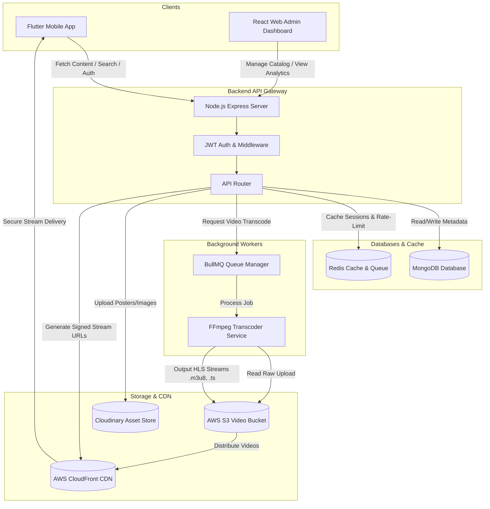

# 🌌 VANIX OTT Platform
> **Unlimited Entertainment. One Universe.** A futuristic, premium Over-The-Top (OTT) streaming ecosystem.

**VANIX** is a complete, production-ready, next-generation OTT streaming system. It features a cross-platform mobile application (built in Flutter), a highly scalable RESTful API backend (built in Node.js & Express), and a modern Web Admin Panel (built in React & Vite) for content management and analytics.

---

## 📐 System Architecture

Below is the high-level architecture diagram demonstrating how clients, databases, cache layers, background workers, and storage/CDN services interact:



---

## 🛠️ Technology Stack

### 1. Backend Server & Worker ([backend](file:///C:/Users/PC/Desktop/vanix/vanix/backend))
* **Runtime**: Node.js (>= 18.0.0)
* **Framework**: Express.js (REST API & routing)
* **Database**: MongoDB (Mongoose ODM for schemas)
* **Cache & Queue**: Redis (BullMQ for background video transcoding jobs)
* **Video Processing**: Fluent-FFmpeg (Adaptive Bitrate streaming generation)
* **Storage**: AWS S3/Cloudflare R2 (Video assets hosting) & Cloudinary (Image/Poster hosting)
* **Security**: JSON Web Tokens (JWT), bcryptjs (password hashing), Helmet (HTTP headers protection), Express Rate Limit (DDoS protection)

### 2. Admin Control Dashboard ([admin_panel](file:///C:/Users/PC/Desktop/vanix/vanix/admin_panel))
* **Framework**: React.js (Vite environment)
* **Styling**: Vanilla CSS with custom premium tokens
* **Routing**: React Router DOM (v6)
* **Analytics**: Recharts (interactive charts and visual metrics)
* **API Client**: Axios (configured with interceptors)
* **Icons**: Lucide React & Heroicons

### 3. Mobile App Client ([lib](file:///C:/Users/PC/Desktop/vanix/vanix/lib))
* **Framework**: Flutter SDK (Cross-platform Dart)
* **State Management**: Provider (robust app-wide state)
* **Animations**: Flutter Animate (sleek micro-interactions)
* **Video Playback**: Chewie & Video Player (custom skin with volume/brightness gestures)
* **Image Loading**: Cached Network Image with Shimmer loading states
* **Storage**: Shared Preferences & Flutter Secure Storage (safe JWT token handling)

---

## 📁 Repository Structure

```
vanix/
├── apk/                  # Pre-built Android APK releases
├── assets/               # Global static assets (icons, brand marks)
├── lib/                  # Flutter mobile application Dart source code
│   ├── core/             # Shared constants, network clients, themes, global widgets
│   └── features/         # Modular feature folders (auth, home, player, watchlist, trailers)
├── backend/              # Node.js Express API & Transcoder Worker source
│   ├── src/
│   │   ├── config/       # Environment & database connection setups
│   │   ├── controllers/  # Route controllers (auth, content, billing)
│   │   ├── middlewares/  # Express middlewares (auth interceptors, rate-limiters)
│   │   ├── models/       # MongoDB/Mongoose models
│   │   ├── queue/        # Redis queue setup for BullMQ
│   │   ├── routes/       # Route definitions for all endpoints
│   │   └── services/     # FFmpeg transcoding, signed URLs, FCM integrations
│   └── tests/            # Jest integration & unit test suites
├── admin_panel/          # React Vite Web Administration Panel
│   ├── src/
│   │   ├── components/   # Reusable UI widgets (modals, sidebar, cards)
│   │   ├── context/      # Authentication and routing contexts
│   │   ├── pages/        # Main pages (Dashboard, Movies, Users, Analytics)
│   │   └── services/     # Axios client and API bindings
├── deployment/           # Production deployment setups (Docker, PM2, Nginx)
├── docs/                 # Swagger/OpenAPI details and developer documentation
└── codemagic.yaml        # CI/CD pipeline automation settings
```

---

## 🔒 Advanced Core Engines & Implementation Patterns

### 1. Video Transcoding Engine ([transcoder.js](file:///C:/Users/PC/Desktop/vanix/vanix/backend/src/services/transcoder.js))
Adaptive Bitrate (ABR) streaming is critical for zero-lag OTT playback. When a video is uploaded:
1. **Queueing**: The file metadata is added to a Redis-backed BullMQ queue.
2. **Worker Processing**: A worker node picks up the task and extracts raw metadata (bitrate, resolution) via `ffprobe`.
3. **ABR Variant Generation**: FFMPEG compiles the video into HLS streams for multiple resolutions (`360p`, `720p`, `1080p`) based on the input quality.
4. **Master Playlist**: Creates a `master.m3u8` playlist referencing the variant streams.
5. **S3 Upload**: Segments (`.ts` files) and playlists are uploaded to AWS S3/Cloudflare R2.
6. **Fallback**: If FFMPEG is missing on a developer's system, a mock pipeline creates mock HLS playlists to allow local development.

### 2. CDN Signed Streams ([signedUrl.js](file:///C:/Users/PC/Desktop/vanix/vanix/backend/src/services/signedUrl.js))
To prevent users from scraping or sharing video URLs:
- Raw video files are stored in a private S3 bucket.
- The app requests video details through the Express API.
- The backend generates a time-limited **CloudFront Signed URL** using a private RSA key.
- The video player fetches stream chunks using this signature; the URL expires shortly after playback starts.

### 3. JWT Token Rotation & Session Management
- **Access Token**: Short-lived (15 minutes), sent in headers.
- **Refresh Token**: Long-lived (7 days), stored in HTTP-only cookies (web) and secure storage (mobile).
- **Interceptor**: If a request fails with `401 Unauthorized`, the client's interceptor pauses requests, calls the `/refresh` token endpoint, updates the local token store, and retries the original request.
- **Device Tracking**: Keeps track of active login devices, enforcing limit thresholds per account.

### 4. Chunked Offline Downloads ([downloads](file:///C:/Users/PC/Desktop/vanix/vanix/lib/features/downloads))
- A download manager handles downloading video files in blocks/chunks.
- Dart's `path_provider` writes files directly to secure app directories.
- Download state is tracked using SQLite or local storage to support pause/resume/cancel actions.
- Files are saved as encrypted segments to prevent users from copying media directly off the device.

---

## 🚀 Step-by-Step Developer Setup

### Prerequisites
Make sure you have the following installed on your system:
- [Node.js](https://nodejs.org/) (v18+)
- [Flutter SDK](https://docs.flutter.dev/get-started/install) (v3.0.0+)
- [MongoDB](https://www.mongodb.com/try/download/community) (running locally or a Atlas URI)
- [Redis Server](https://redis.io/docs/install/) (for background tasks/queues)
- [FFmpeg](https://ffmpeg.org/download.html) (Optional, but required for live transcoding)

---

### Step 1: Database Setup
1. Start your local MongoDB server:
   ```bash
   mongod
   ```
2. Start your Redis server:
   ```bash
   redis-server
   ```

---

### Step 2: Backend Setup
1. Navigate to the backend directory:
   ```bash
   cd backend
   ```
2. Install dependencies:
   ```bash
   npm install
   ```
3. Configure environment variables. Duplicate the `.env.example` file and name it `.env`:
   ```bash
   cp .env.example .env
   ```
   Update the database connection string, Redis host, and secret keys inside your `.env` file:
   ```env
   PORT=5000
   MONGO_URI=mongodb://localhost:27017/vanix
   REDIS_HOST=127.0.0.1
   REDIS_PORT=6379
   JWT_SECRET=your_jwt_secret_key
   ```
4. Seed the database with sample movies, categories, and plans:
   ```bash
   npm run seed
   ```
5. Run the server in development mode:
   ```bash
   npm run dev
   ```
   *The server will start on `http://localhost:5000`.*

---

### Step 3: Admin Web Dashboard Setup
1. Navigate to the admin panel directory:
   ```bash
   cd ../admin_panel
   ```
2. Install dependencies:
   ```bash
   npm install
   ```
3. Configure the `.env` file to point to the local backend:
   ```env
   VITE_API_URL=http://localhost:5000/api
   ```
4. Launch the dashboard:
   ```bash
   npm run dev
   ```
   *Open `http://localhost:5173` in your browser. Use the admin login created during database seeding.*

---

### Step 4: Flutter Mobile Client Setup
1. Ensure your Flutter environment is correctly set up:
   ```bash
   flutter doctor
   ```
2. Open the main directory (`C:\Users\PC\Desktop\vanix\vanix`) and download Flutter dependencies:
   ```bash
   flutter pub get
   ```
3. Locate the API configuration file (typically in `lib/core/network/api_client.dart` or `lib/core/constants/constants.dart`) and point the base URL to your backend:
   - For Android Emulator: `http://10.0.2.2:5000/api`
   - For iOS Simulator: `http://localhost:5000/api`
   - For Real Devices: Your machine's local IP address (e.g., `http://192.168.1.5:5000/api`). Ensure your device is on the same Wi-Fi network.
4. Launch your emulator or connect a device, and run the app:
   ```bash
   flutter run
   ```

---

## 📦 Building and Deploying

### 1. Build Android APK
Generate an optimized release APK:
```bash
flutter build apk --release
```
The resulting package will be output to `build/app/outputs/flutter-apk/app-release.apk`.

### 2. Build iOS IPA (Unsigned / Local / CI/CD)
To compile the archive file:
```bash
flutter build ipa --release --no-codesign
```
Because iOS builds normally skip generating a `.ipa` file when codesigning is disabled (`--no-codesign`), the automated workflow handles packaging by extracting the `.app` from `build/ios/archive/Runner.xcarchive` into a `Payload` directory and compressing it.

To execute this packaging manually on macOS:
```bash
mkdir -p build/ios/ipa/Payload
cp -r build/ios/archive/Runner.xcarchive/Products/Applications/Runner.app build/ios/ipa/Payload/
cd build/ios/ipa && zip -r Runner.ipa Payload
rm -rf Payload
```

---

## 🔒 Production Hosting Overview
1. **Backend**: Containerize using the provided `Dockerfile` or run under PM2 process management to enable cluster-mode scaling:
   ```bash
   pm2 start src/app.js -i max --name vanix-api
   pm2 start src/queue/worker.js -i 2 --name vanix-transcoder
   ```
2. **Reverse Proxy**: Setup Nginx to handle SSL/TLS termination, rate limit filtering, and routing headers.
3. **Database**: Use MongoDB Atlas for a replicated cluster database.
4. **Cache & Queue**: Deploy Redis in clustered mode.
5. **Assets & Video CDN**: Set up AWS S3 bucket permissions so that files are private, and configure CloudFront with Origin Access Control (OAC) to read from S3. Keep CloudFront signing enabled for stream protection.
